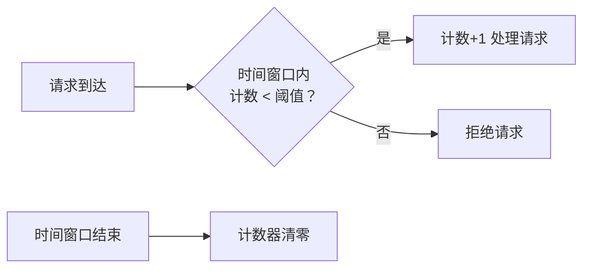
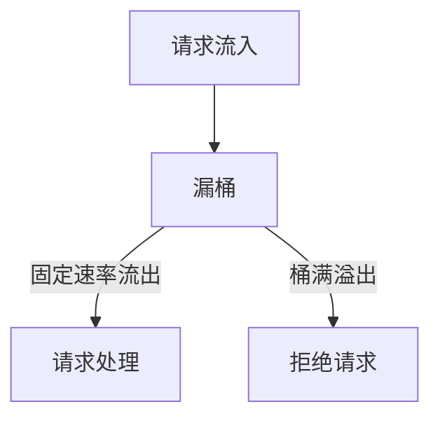
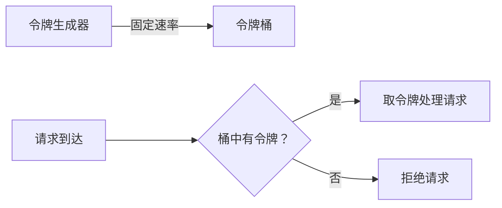

## 限流算法深度解析：计数器、漏桶、令牌桶

### 一、计数器算法（固定窗口算法）
**核心原理**：  
在**固定时间窗口**内统计请求次数，超过阈值则拒绝后续请求



**特点**：
- ✅ **优点**：实现简单，内存占用少
- ❌ **缺点**：存在**临界突刺问题**
  - 例：限流100次/分钟
  - 第59秒收到100请求 → 通过
  - 第61秒再收100请求 → 通过
  - 实际在2秒内处理了200请求

**适用场景**：  
对流量平稳性要求不高的简单场景（如短信验证码发送）

---

### 二、漏桶算法（Leaky Bucket）
**核心原理**：  
模拟水桶漏水过程，**固定速率处理请求**，桶满则溢出（拒绝请求）



**关键参数**：
- **桶容量**：最大积压请求量
- **出水速率**：固定处理速率（如10个/秒）

**特点**：
- ✅ **优点**：  
  ① 平滑流量（削峰填谷）  
  ② 严格限制处理速率
- ❌ **缺点**：  
  ① 无法应对突发流量  
  ② 请求延迟可能较高

**数学表达**：  
若出水速率为 $r$ 请求/秒，桶容量为 $b$  
则最大突发处理量 = $b$，长期平均速率 ≤ $r$

**适用场景**：  
需要**恒定输出速率**的场景（如API网关限流）

---

### 三、令牌桶算法（Token Bucket）
**核心原理**：  
系统以**固定速率**向桶中投放令牌，请求需获取令牌才能被处理



**关键参数**：
- **令牌投放速率**：$r$ 个/秒
- **桶容量**：$b$（最大令牌数）

**特点**：
- ✅ **优点**：  
  ① **允许突发流量**（最多消耗 $b$ 个令牌）  
  ② 兼顾灵活性与保护性
- ❌ **缺点**：  
  实现较复杂（需维护令牌计数）

**数学特性**：
- 长期平均速率 ≤ $r$
- 最大突发处理量 = $b$

**适用场景**：  
需要**应对突发流量**的场景（如电商秒杀系统）
**代码示例**： 
```
<?php

// 注意：此示例为基础令牌桶逻辑，未涉及预热模式。
// 在生产环境，状态（如 $tokensAvailable 和 $lastRefillTime）必须持久化到 Redis 等共享存储中。

class TokenBucket
{
    private $capacity;          // 桶容量 (b): 最大令牌数
    private $refillRate;        // 令牌填充速率 (r): 每秒生成的令牌数
    private $tokensAvailable;   // 当前可用令牌数
    private $lastRefillTime;    // 上次填充令牌的时间戳

    /**
     * 构造函数
     * @param int $capacity 令牌桶的最大容量
     * @param float $refillRate 每秒填充的令牌数
     */
    public function __construct(int $capacity, float $refillRate)
    {
        $this->capacity = $capacity;
        $this->refillRate = $refillRate;
        $this->tokensAvailable = $capacity; // 初始时，桶是满的
        $this->lastRefillTime = microtime(true); // 获取当前微秒时间戳
    }

    /**
     * 填充令牌
     */
    private function refillTokens(): void
    {
        $now = microtime(true);
        $timeElapsed = $now - $this->lastRefillTime; // 计算逝去的时间
        $tokensToAdd = floor($timeElapsed * $this->refillRate); // 根据时间计算要添加的令牌数

        if ($tokensToAdd > 0) {
            // 将新令牌添加到桶中，但不能超过桶容量
            $this->tokensAvailable = min($this->capacity, $this->tokensAvailable + $tokensToAdd);
            $this->lastRefillTime = $now; // 更新上次填充时间
        }
    }

    /**
     * 尝试获取指定数量的令牌
     * @param int $tokens 要获取的令牌数量，默认为1
     * @return bool 如果成功获取令牌，则返回 true；否则返回 false
     */
    public function tryAcquire(int $tokens = 1): bool
    {
        $this->refillTokens(); // 每次尝试获取前先填充令牌

        if ($this->tokensAvailable >= $tokens) {
            $this->tokensAvailable -= $tokens; // 消耗令牌
            return true;
        }
        return false;
    }

    // 实际应用中，您会这样与 Redis 结合使用：
    // public static function getInstanceFromRedis(string $key, int $capacity, float $refillRate): self { /* 从 Redis 加载状态 */ }
    // public function saveStateToRedis(string $key): void { /* 将状态保存到 Redis */ }
}

// --- 使用示例 ---
// 模拟一个每秒允许 5 个请求，最大突发量为 10 的限流器
$limiter = new TokenBucket(10, 5); // 桶容量 10，每秒填充 5 个令牌

echo "尝试获取令牌...\n";

for ($i = 0; $i < 15; $i++) {
    if ($limiter->tryAcquire(1)) {
        echo "请求 " . ($i + 1) . ": 允许通过\n";
    } else {
        echo "请求 " . ($i + 1) . ": 被拒绝 (达到限流)\n";
    }
    usleep(150000); // 暂停 150 毫秒，模拟请求间隔
}

?>
```
---

### 三算法对比表
| **特性**         | 计数器算法       | 漏桶算法         | 令牌桶算法       |
|------------------|------------------|------------------|------------------|
| **平滑性**       | ❌ 突刺明显       | ✅ 绝对平滑       | ✅ 相对平滑       |
| **突发处理**     | ❌ 无法处理       | ❌ 无法处理       | ✅ 支持突发       |
| **实现复杂度**   | ⭐ 简单          | ⭐⭐ 中等         | ⭐⭐ 中等         |
| **内存消耗**     | 低（仅计数）     | 中（需队列）     | 低（仅令牌数）   |
| **典型应用**     | 简单频率限制     | 恒定速率输出     | 弹性流量控制     |
| **流量控制方向** | 控制输入总量     | 控制输出速率     | 控制消费能力     |

---

### 工程实践建议
1. **计数器优化** → 滑动窗口计数器
   - 将大窗口拆分为多个子窗口
   - 例：1分钟限流100次 → 拆分为6个10秒子窗口（每个限流17次）

2. **令牌桶变种** → 预热模式（Guava RateLimiter）
   ```java
   // Guava 令牌桶实现示例
   RateLimiter limiter = RateLimiter.create(
     5, // 每秒5个令牌
     2, // 预热时间2秒
     TimeUnit.SECONDS);
   ```

3. **混合策略**：
   - 外层：令牌桶应对突发流量
   - 内层：漏桶保证恒定处理速率

> 📌 **黄金法则**：  
> - 需要**严格平滑** → 选漏桶  
> - 需要**弹性突发** → 选令牌桶  
> - 追求**简单实现** → 用优化版计数器