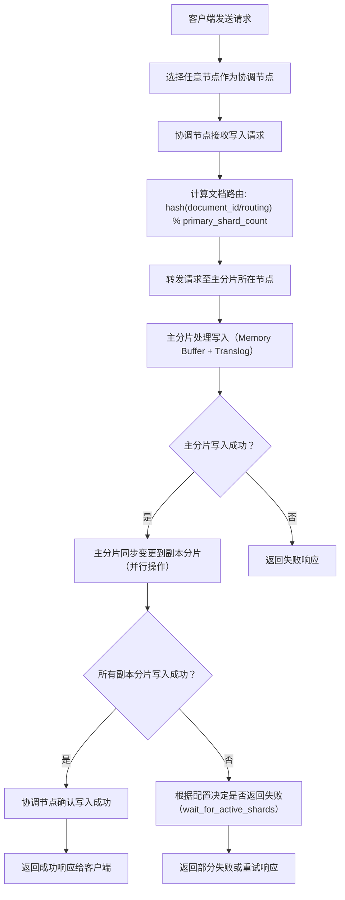

---

### **Elasticsearch 索引数据流程（专业化描述）**

---

#### **1. 客户端请求发送**
- **协调节点选择**  
  客户端通过 REST API 或 Transport Client 向集群中的任意节点（**Coordinating Node**）发送写入请求。  
  - **Coordinating Node**（协调节点）：  
    - **非强制为数据节点或主节点**：集群中任意节点均可充当协调节点，但生产环境中通常部署**专用协调节点**以隔离计算资源（避免数据节点或主节点过载）。  
    - **核心职责**：接收请求、路由分发、聚合结果并返回响应。

---

#### **2. 请求路由**
- **路由计算逻辑**  
  协调节点根据以下规则确定文档的目标主分片（**Primary Shard**）：  
  - **默认路由公式**：  
    ```plaintext
    shard = hash(document_id / routing_value) % number_of_primary_shards
    ```  
    - 若未指定 `routing_value`，则使用文档 ID（`_id`）进行哈希计算。  
    - 若配置了自定义路由（如 `PUT /index/_doc/1?routing=user1001`），则按指定字段计算哈希。  
  - **目标**：确保数据均匀分布在所有主分片中，避免热点问题。

---

#### **3. 处理请求（主分片与副本分片协作）**
- **主分片（Primary Shard）处理流程**  
  1. **内存缓冲区写入（In-Memory Buffer）**  
     - 文档先写入内存缓冲区（**Index Buffer**），此时数据**不可搜索**。  
     - 同时，操作记录被同步写入事务日志（**Translog**），确保在节点故障时可通过 Translog 恢复数据。  
     - **Translog 持久化模式**：  
       - `request`（默认）：每次写入请求后强制刷盘，强一致性但性能较低。  
       - `async`：异步定期刷盘（如每 5 秒），高吞吐但可能丢失部分数据。  

  2. **Refresh 操作（近实时搜索）**  
     - 默认每隔 1 秒（`index.refresh_interval`）触发一次 Refresh：  
       - 将内存缓冲区的数据生成新的 Lucene Segment 并写入文件系统缓存（PageCache）。  
       - 新 Segment 打开后，文档**可被搜索**（近实时搜索，NRT）。  
       - **影响**：频繁 Refresh 会生成大量小 Segment，增加后续 Merge 压力。  

  3. **Flush 操作（持久化到磁盘）**  
     - 当 Translog 大小达到阈值（默认 512MB）或时间间隔（默认 30 分钟），触发 Flush：  
       - 将内存缓冲区的数据写入磁盘，生成新的 Lucene Segment。  
       - 清空 Translog，创建新的 Translog 文件。  

- **副本分片（Replica Shard）同步**  
  - 主分片成功处理写入后，将操作**并行同步**到所有副本分片。  
  - 副本分片重复主分片的写入流程（内存缓冲区 + Translog + Refresh）。  
  - **写一致性控制**：  
    - 通过 `wait_for_active_shards` 参数配置需等待的副本分片数（如 `all`、`quorum`、`1`）。  
    - 默认仅需主分片成功即可返回响应（`consistency` 级别为 `quorum`）。  

---

#### **4. 响应结果**
- **成功响应条件**  
  - 协调节点需收到主分片和至少 `quorum` 数量的副本分片的成功响应（默认 `quorum = (number_of_replicas + 1) / 2 + 1`）。  
  - **示例**：若副本数为 1，则需主分片 + 至少 1 个副本分片成功。  

- **错误处理**  
  - **副本分片写入失败**：  
    - 协调节点标记写入操作为部分失败，返回错误信息（如 `PartialShardFailureException`）。  
    - 可通过 `retry_on_conflict` 参数配置冲突重试次数（适用于更新操作）。  
  - **主分片写入失败**：  
    - 协调节点直接返回失败响应，无需等待副本分片。  

---

#### **5. 高可用性与数据冗余**
- **副本分片作用**  
  - **数据冗余**：副本分片是主分片的完整镜像，确保单节点故障时数据不丢失。  
  - **负载均衡**：查询请求可分发到主分片或任意副本分片，减轻主分片压力。  

- **故障自动恢复**  
  - **分片重分配**：主分片故障时，副本分片自动晋升为新主分片。  
  - **增量数据同步**：节点恢复后，通过 Translog 同步故障期间的增量数据。  

---

#### **6. 总结（专业化流程图）**



---

#### **7. 关键优化策略**
1. **分片配置原则**  
   - **分片大小**：建议 10–50GB，避免过大影响性能。  
   - **副本数**：≥1 保障容错能力；高查询场景可增加副本提升读取吞吐量。  

2. **写一致性配置**  
   - 根据业务需求调整 `wait_for_active_shards`，平衡一致性与可用性。  

3. **专用协调节点**  
   - 在高并发场景下部署专用协调节点，隔离计算资源，降低数据节点负载。  

4. **Translog 优化**  
   - 对于高吞吐场景，可将 `index.translog.durability` 设置为 `async`，但需接受潜在数据丢失风险。  

---

#### **8. 参考配置（YAML）**
```yaml
# 分片与副本配置
index:
  number_of_shards: 3
  number_of_replicas: 1

# Translog 配置
index.translog:
  durability: request  # 强一致性
  flush_threshold_size: 512mb

# 写一致性配置
index.write.wait_for_active_shards: quorum
```

---

### **总结**
- **流程核心**：协调节点负责路由与聚合，主分片处理写入并同步副本分片，最终通过一致性策略返回响应。  
- **关键优化点**：合理配置分片、副本、Translog 和写一致性，结合专用协调节点实现高吞吐与高可用。


### 简单描述
#### 客户端请求发送
  - 客户端选择 Es 集群中的一个节点，发送写入请求。这一节点被称为 coordinating node（协调节点）。协调节点可以是任何一个节点，不必是主节点。
#### 请求路由
  - 协调节点接收到请求后，对文档进行路由，将请求转发给对应的 node。这是通过计算文档的哈希值，来确定文档应该存储到哪个 primary shard（主分片）。
  - Routing 的逻辑是通过文档 ID（如果有提供）或默认的路由规则进行的。通过这些策略，ES 确保数据均匀分布在各个 shards 上。
#### 处理请求
  - Primary shard（主分片）接收到请求后，会执行如下操作：
    - 将文档索引到该主分片中。这涉及到创建或更新倒排索引。
    - 数据在主分片内成功处理后，主分片会将数据变更同步到其关联的 replica shards（副本分片）。这一步确保数据的冗余和高可用性。
    - 副本分片接收到数据后，会重复相同的索引过程，以确保主从分片数据一致。
#### 响应结果：
  - 当协调节点收到主分片和所有副本分片的成功响应后，才会返回结果给客户端。（这确保了写操作的成功性，将最终一致性提供给调用者。）
  - 如果在此过程中出现任何错误（例如，副本分片未能成功写入），协调节点将会考虑写入操作失败并返回相关错误信息。
#### 总结如下：
  - 客户端选择一个 node 发送请求过去，这个 node 就是 coordinating node （协调节点）
  - coordinating node 对 document 进行路由，将请求转发给对应的 node（有 primary shard）
  - 实际的 node 上的 primary shard 处理请求，然后将数据同步到 replica node
  - coordinating node 等到 primary node 和所有 replica node 都执行成功之后，返回响应结果给客户端。