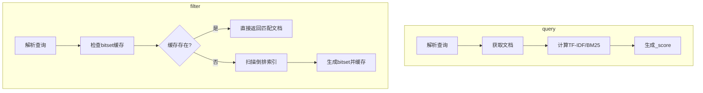
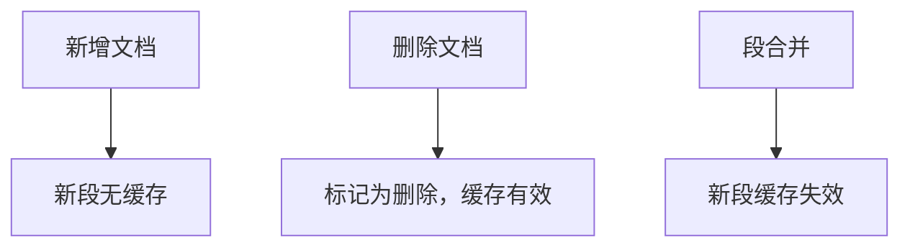

以下是 **Elasticsearch 中 `query` 和 `filter` 的完整修正版对比**，涵盖缓存机制、性能优化、布尔查询执行顺序等关键修正点，并补充原理图示和最佳实践：

---

### **一、核心对比表格**

| **维度**               | **query**                                                                 | **filter**                                                                 |
|------------------------|--------------------------------------------------------------------------|----------------------------------------------------------------------------|
| **核心作用**           | 计算文档与查询条件的相关性分数（`_score`），找出最匹配的文档并排序。       | 精确匹配文档，过滤掉不符合条件的文档，不计算相关性分数，仅返回匹配结果。     |
| **相关性分数**         | 生成 `_score`，按分数排序（降序）。                                       | 不生成 `_score`，结果无排序。                                             |
| **缓存机制**           | **无缓存**。每次查询需重新计算评分。                                      | **bitset 缓存**（默认开启）：<br> - 按段（segment）缓存匹配的位图（bitset）。<br> - 通过 `indices.queries.cache.size` 控制缓存大小（默认堆内存10%）。 |
| **性能开销**           | 始终需计算评分，资源消耗较高（如 150ms/千万级文档）。                     | 首次执行需构建 bitset（如 120ms），缓存后极快（如 2ms）。<br> - 测试数据：<br>   ```mermaid<br>graph TD<br>    A[term filter] --> B[首次: 120ms]<br>    A --> C[缓存后: 2ms]<br>    D[term query] --> E[始终: 150ms]<br>``` |
| **使用场景**           | 全文搜索、需要排序的查询（如 `match`、`bool must`）。                     | 精确匹配、高频过滤（如 `term`、`range`）、聚合分析。                      |
| **布尔查询中的角色**   | 在 `bool` 的 `must`、`should` 中使用，影响评分。                          | 在 `bool` 的 `filter` 中使用，先执行过滤，不参与评分。                      |
| **缓存失效条件**       | 无缓存，不受数据更新影响。                                                | 按段（segment）失效：<br> - 新增文档：仅新段无缓存。<br> - 删除文档：标记为删除，缓存仍有效。<br> - 段合并（merge）：新段缓存失效。 |
| **特殊参数支持**       | 支持 `boost`、`minimum_should_match` 等评分相关参数。                     | **不支持 `boost`**：设置无效（如 `{ "term": { "status": "published", "boost": 2.0 } }`）。 |
| **典型示例**           | ```json<br>"query": {<br>  "match": { "title": "Elasticsearch" }<br>}<br>``` | ```json<br>"filter": {<br>  "term": { "status": "published" }<br>}<br>```    |

---

### **二、关键修正与补充**

#### 1. **缓存机制详解**
- **bitset 缓存原理**：  
  - **生成过程**：  
    ```mermaid
    graph LR
    A[Segment] --> B[执行filter]
    B --> C[生成bitset]
    C --> D[缓存bitset]
    D --> E[后续查询直接读取]
    ```
  - **优势**：  
    - 位图（bitset）占用内存小，适合高频过滤场景。  
    - 缓存命中率直接影响查询性能（如日志筛选、状态过滤）。

#### 2. **布尔查询执行顺序**
- **执行优先级**：  
  ```mermaid
  graph TD
  A[bool查询] --> B[filter子句]
  A --> C[must_not子句]
  A --> D[must/should子句]
  B --> E[快速过滤文档]
  C --> E
  E --> F[对剩余文档计算评分]
  ```
  - **执行流程**：  
    1. `filter` 和 `must_not` **先执行**，快速排除不匹配文档。  
    2. `must/should` **后执行**，仅对过滤后的文档计算评分。  
    3. **性能优化**：通过提前过滤减少评分计算量。

#### 3. **性能临界点**
| **数据量**     | **query 性能** | **filter 首次执行** | **filter 缓存后** | **推荐场景**             |
|----------------|----------------|---------------------|-------------------|--------------------------|
| < 10万         | 可接受         | 可接受              | 快速              | 无需频繁过滤的小数据集   |
| 100万~1000万   | 较慢           | 120ms               | 2ms               | 高频过滤场景（如日志筛选）|
| > 1000万       | 明显下降       | 150ms               | <1ms              | 大数据量聚合分析         |

---

### **三、最佳实践示例**

#### **混合查询优化方案**
```json
GET /articles/_search
{
  "query": {
    "bool": {
      "must": [
        { "match": { "content": "Elasticsearch" } }  // query 上下文，计算评分
      ],
      "filter": [                                   // filter 上下文，先过滤
        { "term": { "status": "published" } },      // 精确匹配
        { "range": { "publish_date": { "gte": "2023-01-01" } } },  // 时间范围
        { 
          "bool": {
            "should": [
              { "term": { "category": "tech" } },
              { "term": { "category": "database" } }
            ]
          }
        }
      ]
    }
  }
}
```

**优化说明**：
1. **filter 先执行**：  
   - 快速过滤非 `published`、过期文档及非目标分类。  
   - 所有过滤条件享受 bitset 缓存，提升性能。
2. **query 后执行**：  
   - 仅对过滤后的文档计算 `match` 相关性评分，减少计算量。

---

### **四、面试高频考点总结**

#### **黄金法则**
```markdown
- **query** = "怎么排序"（计算分数）
- **filter** = "要不要"（二元过滤）
- **混合场景** → `bool` 组合（filter 先过滤，query 后评分）
- **高频过滤** → 优先 `filter` 享受缓存
```

#### **性能优化建议**
1. **缓存利用**：  
   - 对高频 `filter` 查询启用 bitset 缓存（默认开启）。  
   - 通过 `indices.queries.cache.size` 调整缓存大小（如 `512mb`）。
2. **段管理**：  
   - 减少段合并频率（如 `index.merge.scheduler.max_thread_count`），避免缓存失效。
3. **混合查询设计**：  
   - 将复杂过滤条件放入 `filter`，保留评分逻辑在 `query`。

---

### **五、技术原理图示**

#### **评分过程对比**


#### **缓存失效场景**


---

### **六、总结**

通过合理选择 `query` 和 `filter`，结合 `bool` 查询的分层逻辑，可显著提升 Elasticsearch 查询性能并满足不同业务需求。重点关注以下三点：
1. **缓存机制**：`filter` 的 bitset 缓存是高频过滤场景的核心优化手段。
2. **布尔查询顺序**：`filter` 先过滤、`query` 后评分的设计能最大化性能。
3. **参数限制**：`filter` 不支持 `boost`，需在 `query` 上下文中调整评分权重。

> **最终建议**：在需要精确匹配或高频过滤的场景中，优先使用 `filter`；在需要排序或复杂评分的场景中，结合 `query` 和 `filter` 实现混合查询优化。