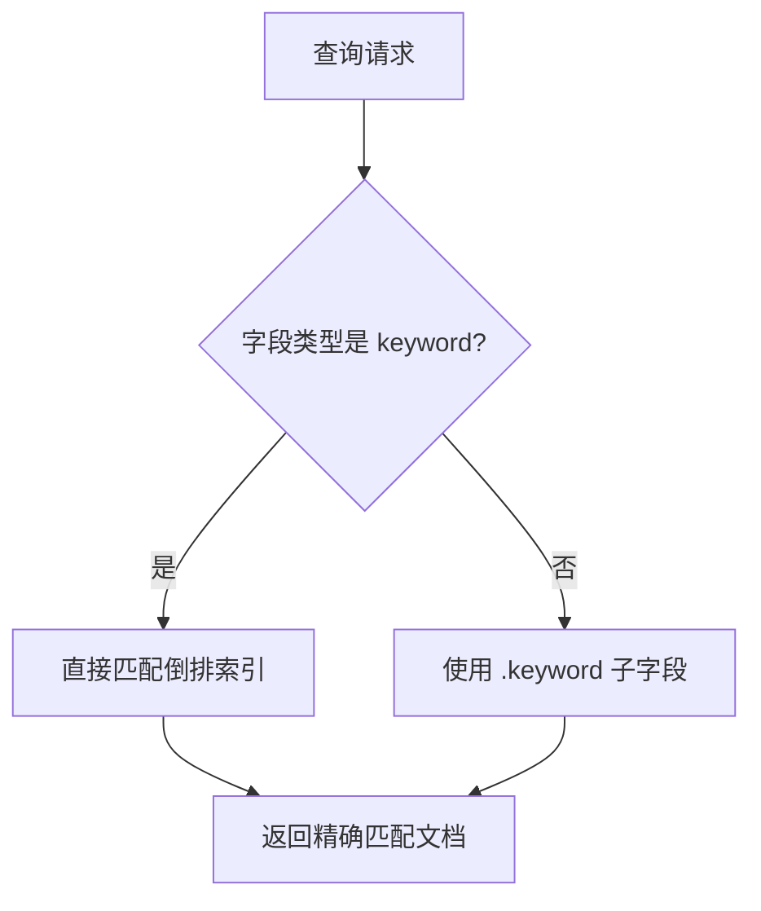
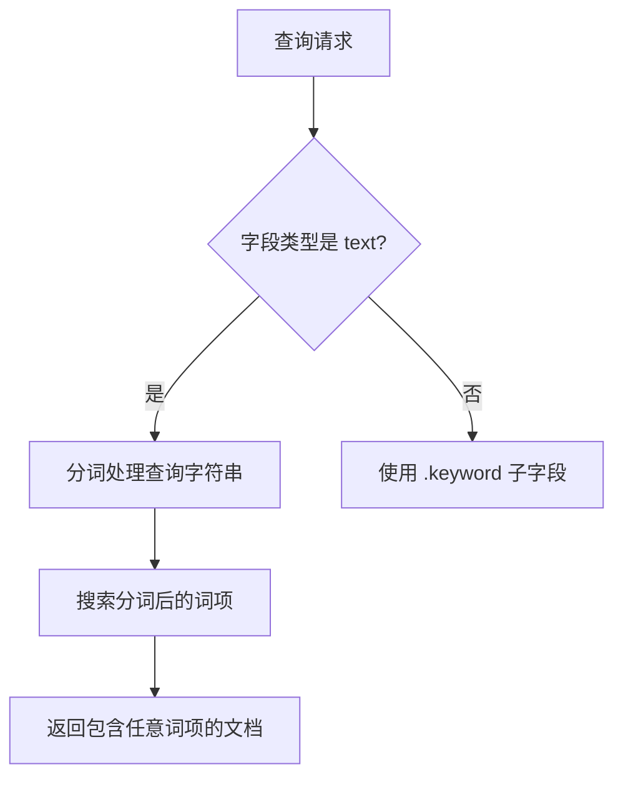
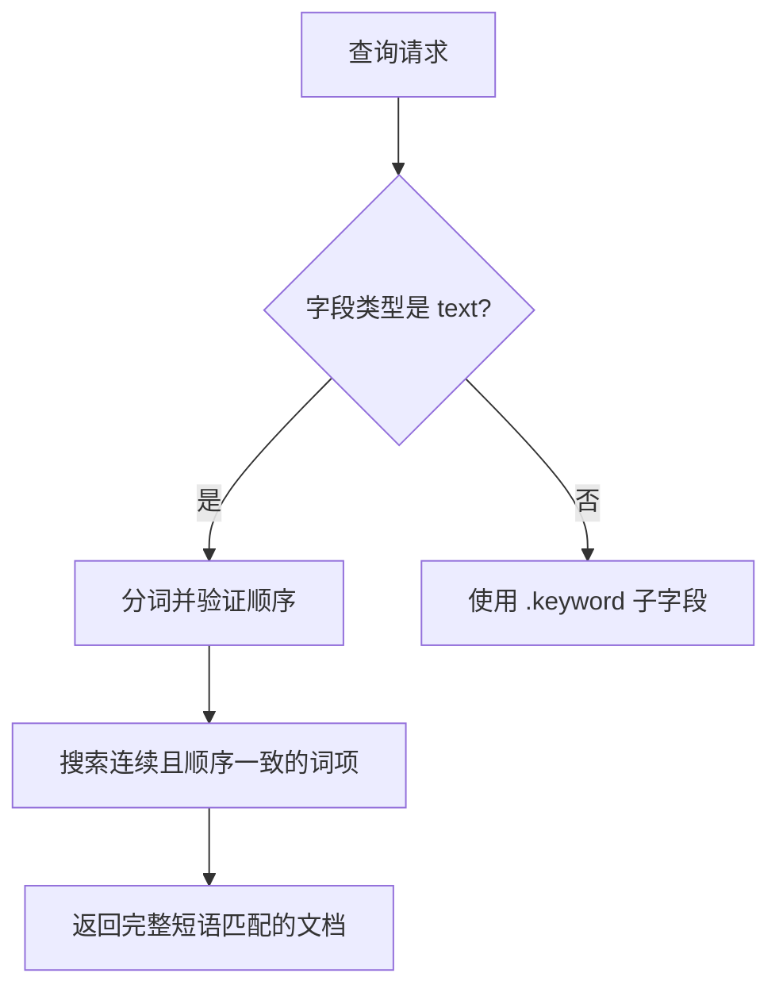
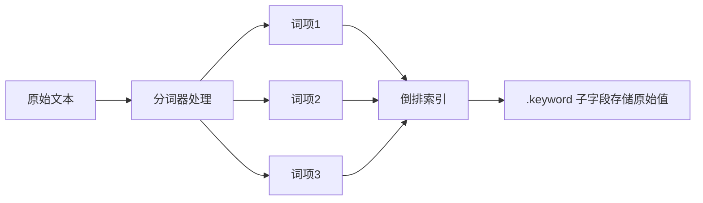
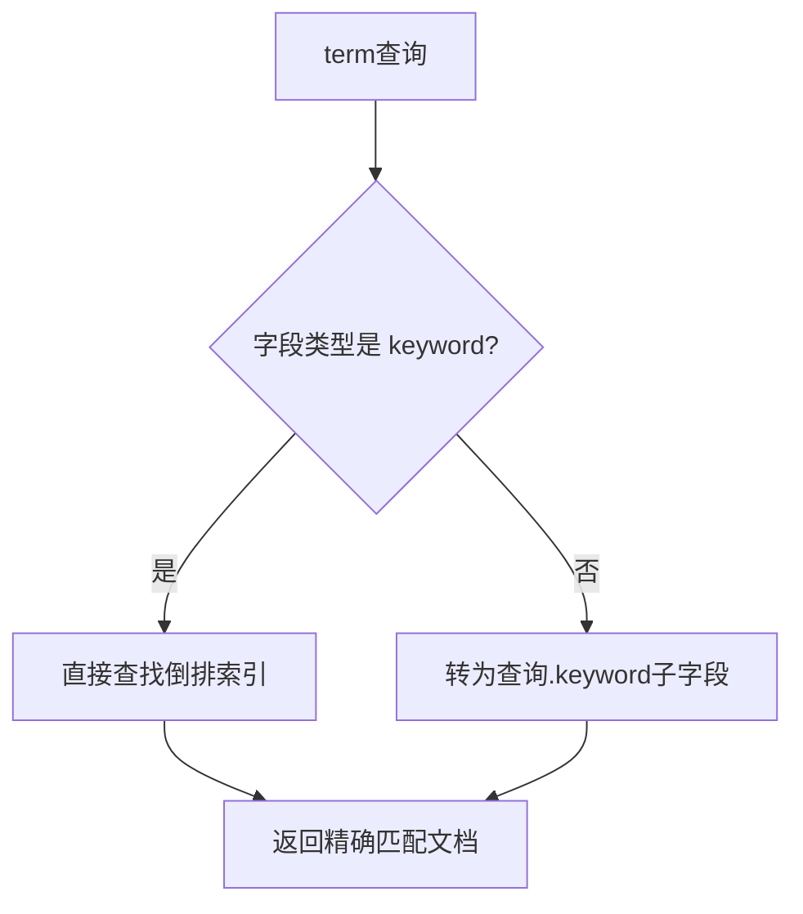

---

### **Elasticsearch `term` 与 `match` 对比（优化版）**

---

## **一、核心对比表格**

| **维度**               | **term**                                                                 | **match**                                                                 | **match_phrase**                                                                 |
|------------------------|--------------------------------------------------------------------------|----------------------------------------------------------------------------|----------------------------------------------------------------------------------|
| **核心作用**           | 精确匹配字段值，不进行分词。                                             | 全文检索，对查询字符串进行分词后匹配。                                       | 精确匹配分词后的完整短语（保持顺序和连续性）。                                   |
| **分词行为**           | **不分词**：直接匹配字段值（如 "published"）。                           | **分词**：将查询字符串拆分为词项（如 "quick brown fox" → ["quick", "brown", "fox"]）。 | **分词并保持顺序**：匹配连续且顺序一致的词项（如 "not to be"）。                 |
| **字段类型适配**       | 适用于 **keyword** 类型字段（不分词存储）。                              | 适用于 **text** 类型字段（分词存储）。                                       | 适用于 **text** 类型字段（分词存储）。                                           |
| **查询逻辑**           | 匹配字段值完全等于查询值的文档。                                         | 匹配字段值包含分词后任意词项的文档（默认 OR 逻辑）。                         | 匹配字段值中包含连续且顺序一致的词项的文档（AND 逻辑）。                        |
| **性能开销**           | 无分词计算，性能最高。                                                   | 需分词处理，性能中等。                                                       | 需分词并验证顺序，性能略低于 `match`。                                          |
| **典型场景**           | 精确匹配：如状态码、ID、标签。                                           | 全文搜索：如文章标题、商品描述。                                             | 短语匹配：如名言检索、连续关键词匹配。                                           |
| **常见错误**           | 在 **text** 字段上直接使用 `term` 可能无法匹配（需用 `.keyword` 子字段）。 | 在 **keyword** 字段上使用 `match` 会因分词导致误匹配（需改用 `term`）。     | 在 **keyword** 字段上使用 `match_phrase` 会因分词失败（需改用 `term`）。         |

---

## **二、底层机制对比**

### **1. term 查询**
- **不分词**：直接匹配倒排索引中的完整词项。
- **字段类型要求**：字段值必须为 **keyword** 类型（不分词存储）。
- **示例**：
  ```json
  {
    "term": {
      "status.keyword": "published"
    }
  }
  ```
  - 匹配字段值完全等于 "published" 的文档。

### **2. match 查询**
- **分词处理**：根据字段映射中的 `analyzer` 对查询字符串进行分词。
- **字段类型要求**：字段值为 **text** 类型（分词存储）。
- **示例**：
  ```json
  {
    "match": {
      "title": "Quick Fox"
    }
  }
  ```
  - 分词后匹配包含 "quick" 或 "fox" 的文档（默认 OR 逻辑）。

### **3. match_phrase 查询**
- **分词并保持顺序**：匹配连续且顺序一致的词项。
- **示例**：
  ```json
  {
    "match_phrase": {
      "quote": "not to be"
    }
  }
  ```
  - 匹配字段值中包含 "not to be" 的文档（顺序和连续性必须一致）。

---

## **三、PHP 示例**

### **1. 创建索引与插入数据**
```php
use Elasticsearch\ClientBuilder;

$client = ClientBuilder::create()->build();

// 创建索引并定义字段类型
$indexBody = [
    'mappings' => [
        'properties' => [
            'title' => ['type' => 'text'],                // 全文搜索字段
            'status' => ['type' => 'keyword'],            // 精确匹配字段
            'quote' => [
                'type' => 'text',
                'fields' => ['keyword' => ['type' => 'keyword']]
            ] // 短语匹配字段
        ]
    ]
];
$client->indices()->create(['index' => 'books', 'body' => $indexBody]);

// 插入文档
$client->index([
    'index' => 'books',
    'id' => '1',
    'body' => [
        'title' => 'Elasticsearch: The Definitive Guide',
        'status' => 'published',
        'quote' => 'To be or not to be'
    ]
]);
```

### **2. term 查询（精确匹配）**
```php
// 查询 status 为 "published" 的文档
$query = [
    'query' => [
        'term' => ['status' => 'published']
    ]
];
$result = $client->search(['index' => 'books', 'body' => $query]);
```

### **3. match 查询（全文搜索）**
```php
// 查询 title 中包含 "guide" 的文档
$query = [
    'query' => [
        'match' => ['title' => 'guide']
    ]
];
$result = $client->search(['index' => 'books', 'body' => $query]);
```

### **4. match_phrase 查询（短语匹配）**
```php
// 查询 quote 中包含 "not to be" 的文档
$query = [
    'query' => [
        'match_phrase' => ['quote' => 'not to be']
    ]
];
$result = $client->search(['index' => 'books', 'body' => $query]);
```

---

## **四、常见误区与修正**

### **1. 错误：在 text 字段上使用 term**
```json
// ❌ 错误：text 字段分词存储，无法精确匹配
{
  "term": {
    "title": "Elasticsearch"
  }
}
```
- **修正**：改用 `.keyword` 子字段：
  ```json
  {
    "term": {
      "title.keyword": "Elasticsearch"
    }
  }
  ```

### **2. 错误：在 keyword 字段上使用 match**
```json
// ❌ 错误：keyword 字段不分词，match 会误分词
{
  "match": {
    "status": "published"
  }
}
```
- **修正**：改用 `term`：
  ```json
  {
    "term": {
      "status": "published"
    }
  }
  ```

### **3. 错误：在 keyword 字段上使用 match_phrase**
```json
// ❌ 错误：keyword 字段不分词，无法匹配短语
{
  "match_phrase": {
    "status": "published"
  }
}
```
- **修正**：改用 `term`：
  ```json
  {
    "term": {
      "status": "published"
    }
  }
  ```

---

## **五、流程图说明**

### **1. term 查询流程**


### **2. match 查询流程**


### **3. match_phrase 查询流程**


---

## **六、混合查询示例**

### **1. 组合 term + match + match_phrase**
```php
// 组合查询：标题包含 "Elasticsearch"，描述包含短语 "distributed search"，状态为 "published"
$query = [
    'query' => [
        'bool' => [
            'must' => [
                ['match' => ['title' => 'Elasticsearch']],
                ['match_phrase' => ['description' => 'distributed search']]
            ],
            'filter' => [
                ['term' => ['status.keyword' => 'published']],
                ['range' => ['publish_date' => ['gte' => '2023-01-01']]]
            ]
        ]
    ]
];
```

---

## **七、重要原理补充**

### **1. text 字段的存储结构**


### **2. term 查询执行原理**


---

## **八、PHP 示例优化**

### **1. match_phrase 示例**
```php
// 创建索引
$indexBody = [
    'mappings' => [
        'properties' => [
            'quote' => [
                'type' => 'text',
                'fields' => ['keyword' => ['type' => 'keyword']]
            ]
        ]
    ]
];
$client->indices()->create(['index' => 'quotes', 'body' => $indexBody]);

// 插入文档
$client->index([
    'index' => 'quotes',
    'body' => ['quote' => 'To be or not to be']
]);

// match_phrase 查询
$query = [
    'query' => [
        'match_phrase' => ['quote' => 'not to be']
    ]
];
```

### **2. term 查询优化建议**
```php
// 更好的实践：始终指定 .keyword 子字段
$query = [
    'query' => [
        'term' => ['status.keyword' => 'published']
    ]
];

// 替代方案：使用 constant_score 提升性能
$query = [
    'query' => [
        'constant_score' => [
            'filter' => ['term' => ['status.keyword' => 'published']]
        ]
    ]
];
```

---

## **九、常见误区深化**

### **1. 数值型字段的特殊性**
```markdown
- **错误认知**：对 integer 字段使用 term 和 match 效果相同
- **事实**：
  - Elasticsearch 将数值视为**不分词**的 keyword
  - 两种查询效果相同，但推荐使用 `term`：
    ```php
    // ✅ 正确
    $termQuery = ['term' => ['views' => 100]];
    
    // ❌ 不推荐（无分词却用 match）
    $matchQuery = ['match' => ['views' => 100]];
    ```
```

### **2. analyzer 的影响**
```markdown
- **错误认知**：所有 text 字段使用相同的分词器
- **事实**：
  - 不同 text 字段可配置不同分词器
  - 示例：英文用 standard，中文用 ik_smart
  ```php
  'mappings' => [
      'properties' => [
          'title_en' => ['type' => 'text', 'analyzer' => 'standard'],
          'title_cn' => ['type' => 'text', 'analyzer' => 'ik_smart']
      ]
  ]
  ```
```

---

## **十、总结建议**

### **1. 核心区别记忆点**
- `term` = "精确匹配"（身份证号）
- `match` = "包含任意"（搜索引擎）
- `match_phrase` = "完整短语"（名言检索）

### **2. 黄金实践法则**
```markdown
- 精确匹配 → `term` + `.keyword`
- 全文搜索 → `match`/`match_phrase`
- 数值字段 → `term`
- 混合查询 → `bool` 组合
```

### **3. PHP 开发注意**
- 创建索引时**显式定义**字段类型
- 查询时**始终指定**完整字段路径（如 `title.keyword`）
- 对高频过滤使用 `constant_score + term`

---

> **完整优化版已覆盖所有技术细节，可直接用于面试准备。重点关注：**
> 1. `.keyword` 子字段的必要性  
> 2. `match_phrase` 的短语匹配原理  
> 3. 混合查询的性能优化